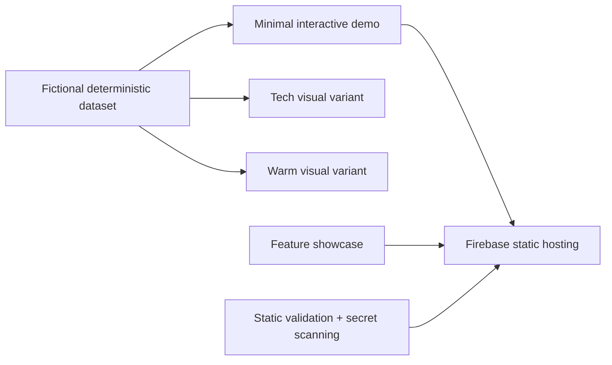

# Altusa AI — Warehouse Operations Demo

Altusa WMS is a self-guided warehouse operations prototype built for owner-operated
wholesalers and their teams. It demonstrates how inventory, bin locations, pick-list
intake, picking, review, and order history can fit into one understandable workflow.

[Explore the feature tour](styles/features.html) ·
[Open the interactive demo](styles/index-minimal.html)

> This repository contains fictional data only. Every SKU uses the `DEMO-` prefix,
> all people and customers are invented, and every interaction resets when the page
> reloads.

## What you can try

- Search 64 fictional SKUs by item, SKU, or barcode.
- Explore a 6-aisle, 192-bin warehouse map.
- Assign, replace, add, and remove inventory locations.
- Paste a pick list or use the clearly labeled simulated OCR path.
- Follow a walk-sorted picking route with Picked, Short, and Skip actions.
- Move an order through Picker → Reviewer → Editor.
- Edit quantities with an `EDITED` audit marker.
- Add notes, manager-approved refunds, and local PDF metadata.
- Filter several months of order history.
- Try simulated HID, camera, and photo barcode inputs.
- Import and export fictional inventory CSV files.
- Review a session-only notification and activity history.

The separate [feature showcase](styles/features.html) provides a guided product tour,
working-feature filters, and a clear explanation of prototype boundaries.

## Demo roles

| Role | PIN | Capabilities |
|---|---:|---|
| Alex · Staff | `1471` | Pick orders and maintain bin locations |
| Sam · Manager | `2582` | Staff access plus review, quantity edits, refunds, and inventory import |
| Admin | `9000` | All controls available in the prototype |

These are presentation-only credentials inside an offline static prototype. They are
not production authentication.

## Run locally

Requirements: Node.js 20+ and the Firebase CLI.

```bash
npm install -g firebase-tools
npm run validate
npm run demo
```

Then open the local URL printed by the Firebase Hosting Emulator. The default route
opens the Minimal demo and `/features` opens the guided feature page.

You can also open any file under `styles/` directly:

- `index-minimal.html` — complete interactive demo
- `index-tech.html` — dark command-center visual study
- `index-warm.html` — warm, approachable visual study
- `features.html` — dynamic product tour

## Architecture



The demo is intentionally simple:

- Self-contained HTML, CSS, and vanilla JavaScript
- No framework, build step, CDN, web font, remote image, or API request
- In-memory state that resets on refresh
- Deterministic fictional dataset generated by `scripts/generate-demo-data.js`
- Hardened Firebase Hosting headers with a restrictive Content Security Policy

See [Architecture](docs/ARCHITECTURE.md) and
[Feature coverage](docs/FEATURES.md) for more detail.

## Validation and security

```bash
npm run validate
npm run security
```

The automated gates verify:

- JavaScript syntax in every HTML page
- Dataset, bin, order, stage, and embedded-data invariants
- No external requests in deployable HTML
- No known private-source identifiers or prohibited filenames
- Gitleaks secret scanning in GitHub Actions
- Firebase routing and security-header configuration

Security concerns can be reported using [SECURITY.md](SECURITY.md).

## Prototype boundaries

This repository demonstrates product behavior and information architecture. It does
not claim to provide production authentication, durable audit storage, real-time
collaboration, carrier labels, accounting/email integrations, real OCR, hardware
scanner access, forecasting, or AI assistance.

Pack-out photos, forecasting, and production integrations are labeled as roadmap
items inside the demo.

## Repository layout

```text
data/       fictional generated warehouse data
docs/       public architecture and feature documentation
scripts/    dataset, embedding, validation, and security utilities
styles/     self-contained demo and feature-tour pages
firebase.json
```

## Contributing

Run `npm run validate` and `npm run security` before opening a pull request. Never
submit real customer, employee, inventory, facility, credential, or production
configuration data.
